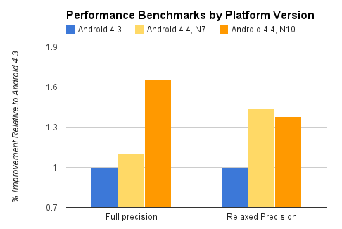

# Function

1. 减少多数组件的内存使用率。Dalvik JIT代码缓存优化、内核同页合并（KSM）、zRAM交换等有助于管理内存。设备制造商可利用新的配置选项优化进程的内存溢出水平、设置图标缓存大小、控制内存回收等
2. 改善内存管理，以减少对堆栈的使用，现在它们更加积极地保护系统内存，防止被其他消耗大量RAM的APP占用。当网络连接断开时，启动服务时，Android会分小组启动，避免内存高峰
3. 新增的API`ActivityManager.isLowRamDevice()`可以判断当前设备是否是低内存设备，我们可以从而禁止那些大内存的操作
4. 利用新工具procstats可以列出一定时间内的内存使用率，以及前台应用和后台服务的运行时间及内存占用量
5. 通过主机卡模拟（HCE）进行基于NFC的安全交易、支付、卡存取、过境通行证和其他自定义服务引入新的平台支持，模拟NFC智能卡。APP可以使用新的读取器模式作为HCE卡和其他基于NFC交易的读取器
6. 引入本地平台打印支持
7. 低功耗传感器
    - 借助传感器批处理功能，Android与设备硬件配合，分批有效的传递事件，而不是检测到这些事件单独传递。在批量事件传递事件，应用处理器一直处于低功耗状态的。传感器批处理适用于低功耗长时间运行的用例。例如健身、位置跟踪、监控等。不过批处理功能只是在Nexus 5上可用
    - 新的复合传感器支持——步测器和计步器。同样两种传感器在Nexus 5上硬件得到支持
8. UI方面：
    - 全屏沉浸模式，全屏任何位置不显示System UI，并且能够接收到事件。System UI可以通过手势滑出
    - 转场动画,Transition架构
    - 透明System UI，例如StatuBar
    - 包含Chromium的WebView全新实现，HTML5与CSS3更广泛的支持，采用更新版本JavaSript(V8)引擎，显著提升JavaScript性能
9. 多媒体
    - 全新的屏幕录制功能，提供屏幕录制使用程序
    - 无缝切换视频分辨率
    - 先支持MPEG-DASH 通用加密（CNEC)
    - HTTP直播流式传播
    - DSP音频隧道，为了是提高性能，低功耗的音频播放。4.4中添加了对芯片组中的数字处理信号DSP音频隧道平台的支持。通过隧道处理，音频解码和输出效应转移到DSP，减少唤醒应用处理器的频率与耗电量。在屏幕关闭情况下可以显著增加电池的寿命。需要硬件支持
    - 可在Visualizer效果中使用新的检测工具
    - 可以使用LoudnessEnhancer效果增强音量
    - 现在能够输出HAL到应用层的显示时间戳，已改善同步音/视频帧的问题
10. 将SurfaceFlinger从OpenGl ES1.0升级到了2.0
11. 连接类型
    - 支持两种蓝牙配置文件，Bluetooth HID over GATT (HOGP) 让应用可以较短的延迟时间与低功耗外围设备（例如鼠标、操纵手柄和键盘）连接。Bluetooth MAP 让您的应用可以与附近的设备（例如无需用手操作的汽车终端或其他移动设备）交换消息。作为对 Bluetooth AVRCP 1.3 的扩展，用户现在可以通过蓝牙设备设置系统的绝对音量
    - 红外发射器
    - Wi-Fi TDLS 支持，在相同 WLAN 网络中的不同设备之间更快地流式传输媒体数据及其他数据
12. RenderScirpt
    - 使用RenderScript将持续得到性能优化
    - GPU加速，需要硬件厂商支持
    - 可以在NDK中使用RenderScript

# API

1. 不申请`READ_EXTERNAL_STORAGE`权限，无法访问外部存储目录。不过如果我们自己的应用访问`getExternalFilesDir()`的话，不用权限也可以访问
2. AlarmManager因为对齐唤醒机制变得不准确，包括`set()`和`setRepeating()`。如果您的闹钟必须在特定时间范围内使用`setWindow()`。如果必须在一个精确的时间，使用`setExact()`
3. 使用ContentResolver同步数据，使用`addPeriodicSync()`创建同步将在默认的Flex指定间隔内某一时间点放生，并且时间不是确切的。targinApi如果小于18，则无效
4. 添加了一套完整的打印框架，`android.printservice.*`
5. 对于短信应用或者相关开发注意一下，Kitkat有部分修改
6. [NFC卡模拟](https://developer.android.google.cn/guide/topics/connectivity/nfc/hce.html)。新的NFC读取器模式支持，在NFC Activity可以开启一些配置
7. 现在在附带红外线发射器(IR)的设备上运行时，可以使用ConsumerIrManager的API发射红外线信号。
8. 多媒体
    - 通过MediaCodec API支持自适应视频播放，播放时分辨率可以调整，MBR的意思？视频深入时可以研究一下
    - AudioTimestamp可获取音频时间戳
    - ImageReader可访问图片缓冲区，从Surface中获取
    - Visualizer.MeasurementPeakRms获取音频流的峰值和有效值
    - LoudnessEnhancer 是 AudioEffect 的一个新子类，允许您增加 MediaPlayer 或 AudioTrack 的音量
    - RemoteController自定义遥控器
    - 播放 HTTP Live Stream (HLS) 视频时，VideoView 支持 WebVTT 字幕跟踪
9. 动画与图形
    - Transition架构，看一下官方3个Sample
    - Animator暂停，`pause()`与`resume()`可作用于动画，跟踪动画状态通过`Animator.AnimatorPauseListener`接口
    - 更新了`inBitmap`复用范围。位图尺寸可以通过`setWidth()`和`setHeight()`来实现
10. 开发为文件提供存储服务的应用，可以使用DocumentsProvider类，子类必须包含能接受`android.content.action.DOCUMENTS_PROVIDER`的过滤器、
    - `queryRoots()`：用`DocumentsContract.Root`定义的列返回一个描述文档存储空间所有根目录的Cursor
    - `queryChildDocuments()`：用`DocumentsContract.Document`中定义的列返回一个描述指定目录中所有文件的Cursor
    - `queryDocument()`：用`DocumentsContract.Document`中定义的列返回一个描述指定文件的Cursor
    - `openDocument()`：返回一个指定文件的`ParcelFileDescriptor`，用户选择了文件，并且客户端应用通过调用`openFileDescirptor()`请求该文件的访问权限后，系统会调用此方法
    - 更详细请阅读[存储访问框架](https://developer.android.google.cn/guide/topics/providers/document-provider.html)
11. 新的传感器类型
    - `TYPE_GEOMAGNETIC_ROTATION_VECTOR`：基于磁力计提供旋转的矢量数据。当处于休眠状态陀螺仪不可用状态下时，用此传感器替代`TYPE_ROTATION_VECTOR`。用户在户外的情况下效果最佳
    - `TYPE_STEP_DETECTOR`：计步器传感器，有误报的可能
    - `TYPE_STEP_COUNTER`：提供步数，不过返回的是应用注册该传感器以来的全部步数。虽然获取数据稍慢一下， 不过数据更加准确
    - 两个计步传感器都依赖于硬件，可以使用`hasSystemFeature()`来检查可用性。特性值为`FEATURE_SENSOR_STEP_DETECTOR`和`FEATURE_SENSOR_STEP_COUNTER`
     

# 短距离无线通讯技术

## NFC

> Near Field Communication, 近场通讯

### 工作模式

1. **点对点模式（P2P mode）：** 就是两个NFC设备通讯，有连接创建速度快，功耗小等特点

    - 这个模式是与蓝牙相对立的，都是实现设备间的数据传递。优点是连接不需要手动设置，功耗低，使用方便等优点。缺点也很明显，连接距离20cm内，传输速率低。NFC在设备密集而传输困难时很实用。NFC不是取代蓝牙的技术，而是在不同场合发挥不同领域相互补充的作用

| \ |    NFC |  Bluetooth |  Bluetooth Low Energy | 
| :--------: | :--------:| :--: | :--: |
| RFID兼容  | ISO 18000-3 |   active  | active | 
| 标准化机构     |  ISO/IEC   |  Bluetooth SIG  | Bluetooth SIG |
| 网络标准     |  ISO 13157 etc.| IEEE 802.15.1| 	IEEE 802.15.1 |
| 网络类型     | Point-to-point|  WPAN  |  WPAN  |
| 加密     |  not with RFID  | available | available |
| 范围     |  < 0.2 m   | ~10 m | ~1 m |
| 频率     |  13.56 MHz   |  2.4-2.5 GHz  | 2.4-2.5 GHz |
| Bit rate     |  424 kbit/s   |  2.1 Mbit/s  | ~1.0 Mbit/s |
| 设置程序     |  < 0.1 s  |  < 6 s  |  < 0.006 s |
| 功耗     |  < 15mA (read) |  varies with class  | < 15 mA (xmit) |

2. **读卡器模式：** 作为非接触读卡器使用，比如从海报或者展览信息电子标签上读取相关信息
3. **卡模拟模式：** 模拟一张IC卡。Android4.4 提供的 HCE就是使用的这种NFC模式

