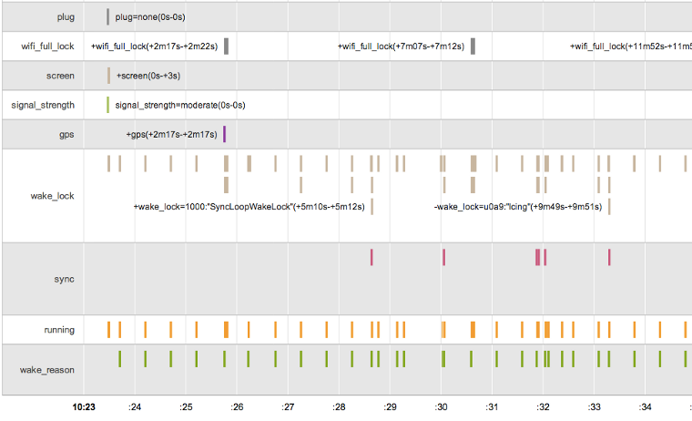

# Function

1. Material Design
    - 引入MD，并提供了工具包
    - 新增三维视图允许设置Z轴纬度，并投射了阴影
    - 新增Activity过场动画，提供共享元素的功能
    - 触摸反馈
    - 可在Xml中绘制矢量，并以各种方式添加动画
    - 新增一种名为渲染线程的系统管理处理线程

2. ART运行时
    - 支持预先编译（AOT）、即时编译（JIT）和解释代码的混合使用。它支持ARM、x86、MIPS架构，并且全面兼容64位
    - 改善应用性能和响应速度，高效的垃圾收集可减少GC事件暂停的次数
    - 5.0侧重提高性能流畅度，提供经过改建的A/V同步，音频和图形管道经过改造后提高时间戳的准确性
3. Android TV支持更全面了
4. 5.0重新设计了“概览”空间，以前称作最近使用的应用，不同Activity在应用屏幕中一同显示
5. 高级连接
    - 新增了允许应用利用低功耗蓝牙并发操作的API，实现扫描(中心模式)和广播(外设模式)
    - NFC API允许应用动态注册NFC应用ID，可以设置每个活动服务的首选卡模拟服务
6. 高性能图形，增强了OpenGl ES 3.1。引入心得扩展，可访问镶嵌着色器、几何着色器、ASTC纹理压缩等
7. 更强大的音频功能
    - 可提供低延迟音频输入（不是很懂）
    - 多声道音频流混音
    - 提供标准USB音频外设支持，允许用户连接USB耳机、扬声器、麦克风等
8. 相机，新增各种相关API
9. 工作场所的开发，新增托管配置进程。教育领域公司内使用时貌似可以了
10. 新的传感器——倾斜传感器、心率传感器、互动复合传感器可检测唤醒手势、拿起手势和扫视等
11. Chromium WebView支持，添加了对WebRTC、WebAudio、WebGL支持。提供所有Web组件原生支持：自定义元素、阴影Dom、HTML导入和模板
12. 新增的Job Scheduling API优化后台。新增`dumpsys batterystats`命令可生成电池使用情况统计信息

13. 浮动通知
14. 修复了自定义权限多应用之间重复的问题
15. TLS/SSL默认配置变更
    - TLS v1.2和 TLS v1.1协议已启用
    - AES-GCM (AEAD) 加密套件现已启用
    - MD5、3DES、导出和静态密钥 ECDH 加密套件现已停用
    - 首选使用 Forward Secrecy 加密套件（ECDHE 和 DHE）

# API

1. RemoteControlClient已经弃用，尽快切换到MediaSession
2. `ActivityManager.getRecentTasks()`已经被弃用，改用`getAppTasks()`
3. `Context.bindService()`绑定服务只能显示绑定，不能传递隐式Context，也不要注册IntentFilter
4. WebView相关
    - WebView默认会阻止[混合内容](https://developer.mozilla.org/en-US/docs/Web/Security/Mixed_content)或者第三方Cookie，请分别使用`setMixedContentMode()`和`setAcceptThirdPartyCookies()`方法
    - 会智能绘制HTML文档部分，有助于减少内存和提升性能。如果要一次渲染整个文档，可调用`enableSlowWholeDocumentDraw()`停止此优化

